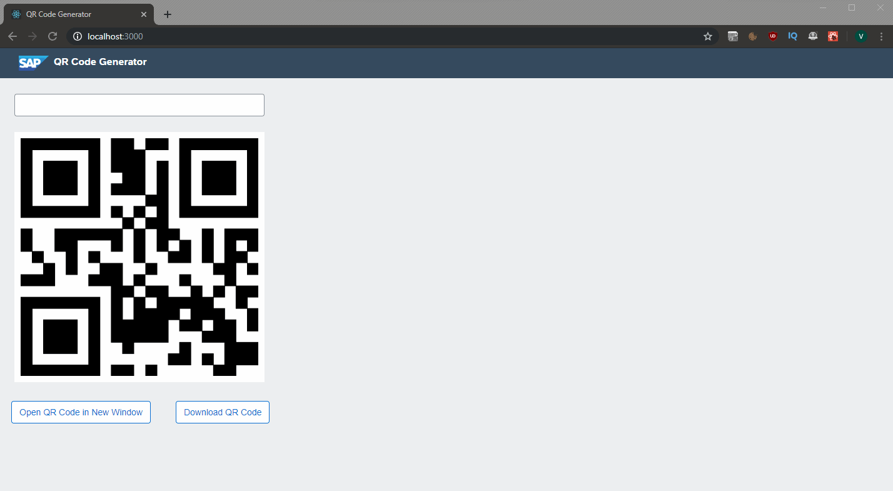

# react-qrcode-generator

A very basic React web application which generates QR codes on the fly, featuring the latest SAP UI5 styling.

Please note that this functionality only works on Google Chrome.

## Demo

To start the app:

    git clone git@github.com:krynv/react-qrcode-generator.git
    npm i
    npm start

Access the application at: http://localhost:3000/
